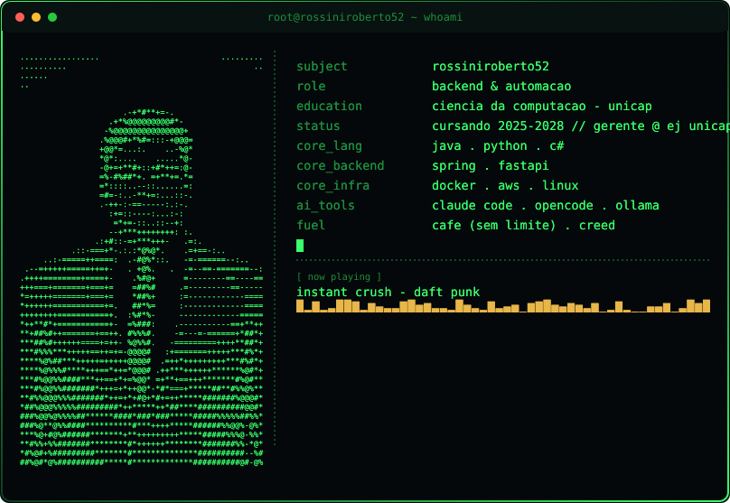

 

  

 

### Backend & Automação

Curso **Ciência da Computação na UNICAP** (2025-2028) e atuo como Gerente na EJ Unicap,
liderando a área de computação e ajudando a transformar ideias em sistemas que funcionam de verdade.

O interesse por código começou aos 8 anos, quando música e computador se cruzaram pela primeira vez.
Hoje, meu trabalho mora nos bastidores: APIs em Java, automações e arquiteturas desenhadas
para rodar com estabilidade e o mínimo de atrito.

🤖 Uso ferramentas de IA e agentes (Claude Code, OpenCode e afins) no dia a dia de desenvolvimento —
desde prototipagem até automação de tarefas repetitivas.

 

### 🛠️ Stack

**Backend & IA**

**Game Dev**

**Infra & Ferramentas**

**AI Tools & Agents**

 

### 📊 Stats

 

### 🌐 Onde me achar

